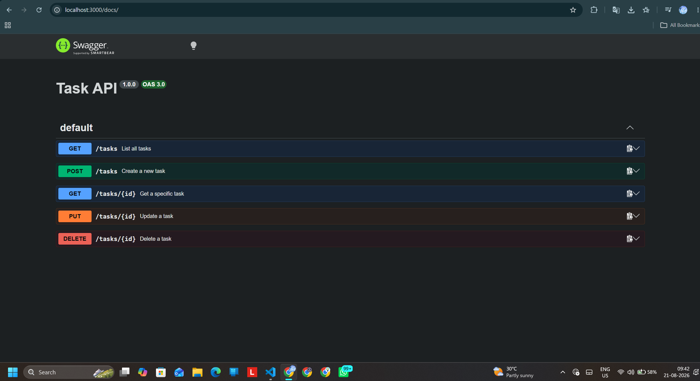

# Task CRUD API
A simple in-memory REST API for managing a to-do list, built with Node.js and Express.

## How to Run
1. Install dependencies: `npm install`
2. Start the server: `node index.js`

## Endpoints
| Method | Path | Description |
|---|---|---|
| GET | `/` | API info |
| GET | `/health` | Server health check |
| GET | `/tasks` | List all tasks |
| POST | `/tasks` | Create a task |
| GET | `/tasks/:id` | Get a specific task |
| PUT | `/tasks/:id` | Update a task |
| DELETE | `/tasks/:id` | Delete a task |

## Example Request
`curl -i -X POST http://localhost:3000/tasks -H "Content-Type: application/json" -d '{"title":"Buy milk"}'`

## Swagger UI
