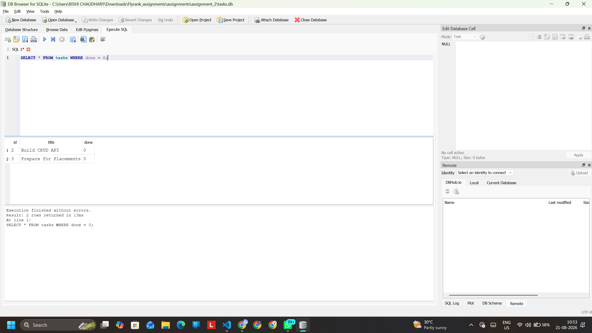

# Database-Backed CRUD API

This API is functionally identical to Assignment 1, but the storage layer has been migrated from memory to a SQLite database. 

## Why SQLite?
SQLite was chosen because it requires zero configuration, operates entirely out of a single local file (`tasks.db`), and provides immediate data persistence across server restarts without the overhead of running a separate database server. 

## How to Run
1. Install dependencies: `npm install`
2. Start the API: `node index.js`
*(The `tasks.db` file and the `tasks` table will be created automatically on the first run, seeded with 3 example tasks).*

## Exploratory SQL
During development, I tested the database manually using DB Browser. One query I ran was:
`SELECT * FROM tasks WHERE done = 0;`
**Result:** This successfully returned only the tasks that were still marked as incomplete (0).

## Database Visualization
