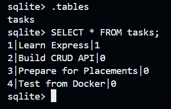

# Containerize Your Stack (SQLite in Docker)

This API is functionally identical to Assignment 2 (same 5 CRUD endpoints, same
validation, same status codes). What changed this week is **infrastructure, not
behaviour**: the app and its database now run in a Docker container, started with
one command, with data persisted through a named volume.

## Why SQLite instead of Postgres?

The base assignment asks for Postgres, but since Assignment 2 already used SQLite,
the instructor confirmed on the course Q&A that containerizing SQLite instead of
Postgres is acceptable for this submission. So instead of swapping storage engines
again, this assignment containerizes the existing SQLite-backed API and focuses on
the actual learning goals of the week: Docker images/containers, volumes for
persistence, `.env` for config, and `docker compose up` as a single start command.

## What this is

- Node.js + Express task CRUD API
- SQLite storage via `better-sqlite3`
- Runs inside a Docker container
- Database file lives on a named Docker volume (`taskdata`), so it survives
  `docker compose down` / `docker compose up`
- Config (port, db file path) comes from `.env` — never hardcoded

## How to run (one command)

\`\`\`bash
cp .env.example .env
docker compose up
\`\`\`

The API will be available at `http://localhost:3000`.

## Environment variables

See `.env.example`:

| Variable  | Meaning                                   | Example              |
| --------- | ------------------------------------------ | --------------------- |
| `PORT`    | Port the API listens on                    | `3000`                |
| `DB_PATH` | Path to the SQLite file (inside container) | `/app/data/tasks.db`  |

## Endpoints

| Method | Path         | Description             | Success | Error         |
| ------ | ------------ | ------------------------ | ------- | ------------- |
| GET    | `/health`    | DB health check           | 200     | 500           |
| GET    | `/tasks`     | List all tasks            | 200     | -             |
| GET    | `/tasks/:id` | Get one task              | 200     | 404           |
| POST   | `/tasks`     | Create a task              | 201     | 400           |
| PUT    | `/tasks/:id` | Update a task              | 200     | 400 / 404     |
| DELETE | `/tasks/:id` | Delete a task              | 204     | 404           |

## Example

\`\`\`bash
curl -i http://localhost:3000/tasks
\`\`\`

\`\`\`
HTTP/1.1 200 OK
Content-Type: application/json; charset=utf-8

[{"id":1,"title":"Learn Express","done":1}, ...]
\`\`\`

## Persistence proof

1. `docker compose up`
2. Create a task with `POST /tasks`
3. `docker compose down`
4. `docker compose up` again
5. `GET /tasks` still shows the task — the `taskdata` volume kept it.

## Database Visualization

*(Screenshot of `tasks` table inside the running container, taken with
`docker exec -it <container> sqlite3 /app/data/tasks.db` running `.tables` and
`SELECT * FROM tasks;`)*