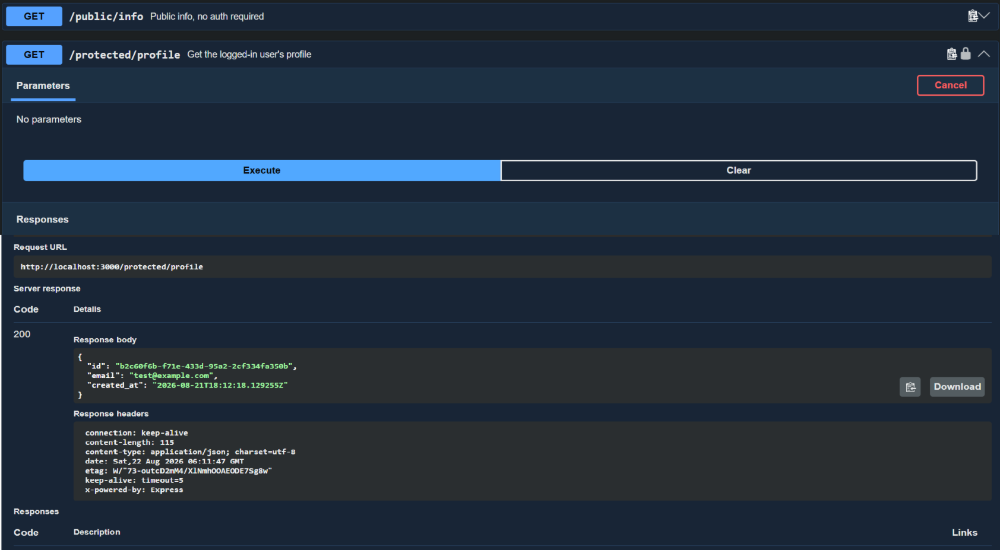

# Auth — Login & Protect (Supabase Auth)

A secure task API using **Supabase Auth** as the Identity Provider. Handles
sign up, log in, log out, and protects specific routes so they only answer
for logged-in users — verified via JSON Web Tokens (JWTs).

## What this is

- Node.js + Express API
- Supabase Auth for account management, password hashing, and JWT issuance
- A reusable auth middleware that verifies bearer tokens and guards routes
- Swagger UI with bearer-auth padlocks on protected routes

No password hashing or token-signing is done in this code — Supabase handles
all of that. This app's job is receiving a token, verifying it with Supabase,
and opening (or refusing) the door.

## How to run

\`\`\`bash
npm install
cp .env.example .env
\`\`\`

Fill in `.env` with your own Supabase project's URL and anon key (see below), then:

\`\`\`bash
node --env-file=.env index.js
\`\`\`

Server runs at `http://localhost:3000`. Swagger docs at `http://localhost:3000/docs`.

## Environment variables

See `.env.example`:

| Variable       | Meaning                                  |
| -------------- | ------------------------------------------ |
| `SUPABASE_URL` | Your Supabase project's URL                |
| `SUPABASE_KEY` | Your Supabase project's anon public key    |
| `PORT`         | Port the API listens on                    |

## Endpoints

| Method | Path                   | Description                  | Auth required |
| ------ | ----------------------- | ------------------------------ | :-----------: |
| POST   | `/auth/signup`          | Create a new user account       | No            |
| POST   | `/auth/login`           | Log in, returns access token    | No            |
| POST   | `/auth/logout`          | End the user's session           | Yes           |
| GET    | `/public/info`          | Public, open data                | No            |
| GET    | `/protected/profile`    | Get logged-in user's profile     | Yes           |
| GET    | `/protected/dashboard`  | Protected dashboard (proves middleware reuse) | Yes |

## Example

\`\`\`bash
curl -i -X POST http://localhost:3000/auth/signup \\
  -H "Content-Type: application/json" \\
  -d '{"email":"test@example.com","password":"password123"}'
\`\`\`

\`\`\`
HTTP/1.1 201 Created
Content-Type: application/json; charset=utf-8

{"id":"...","email":"test@example.com", ...}
\`\`\`

## Swagger UI

`/docs` shows a lock icon on every protected route. Paste an access token
into "Authorize" once, and "Try it out" works on any protected route without
manually building curl commands.

